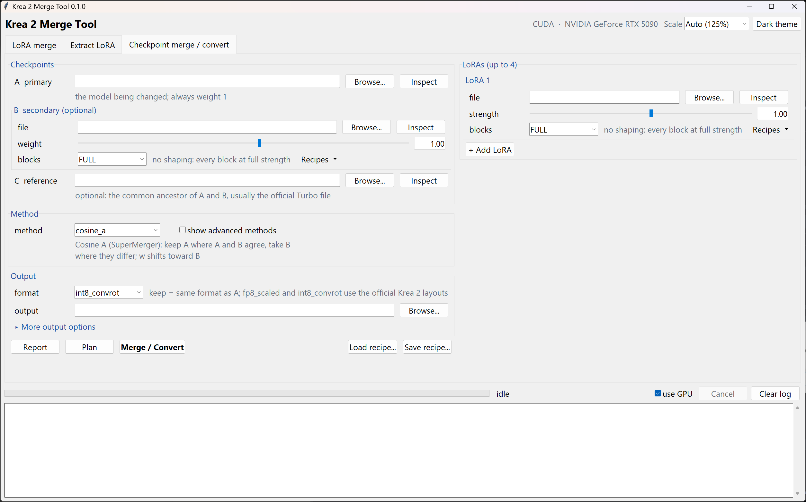
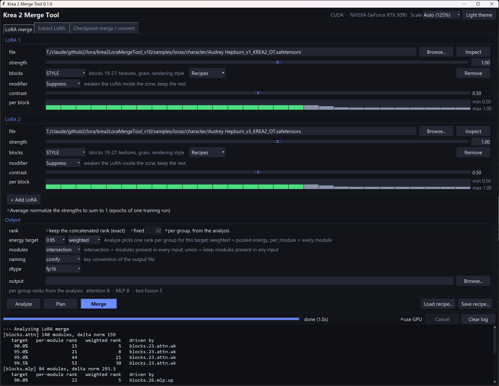
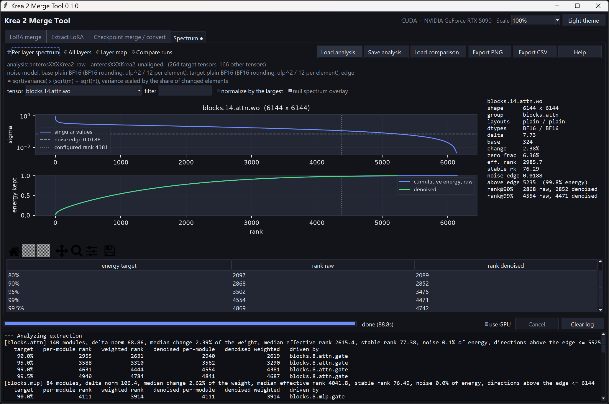
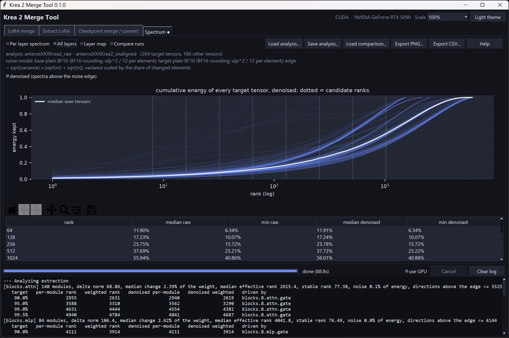
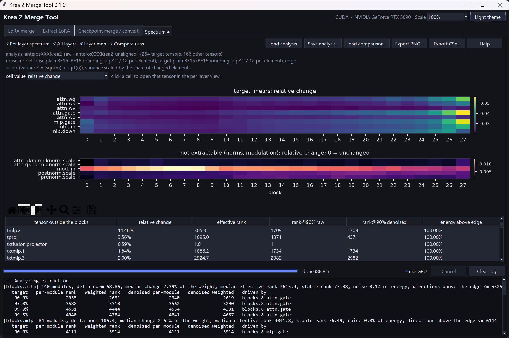
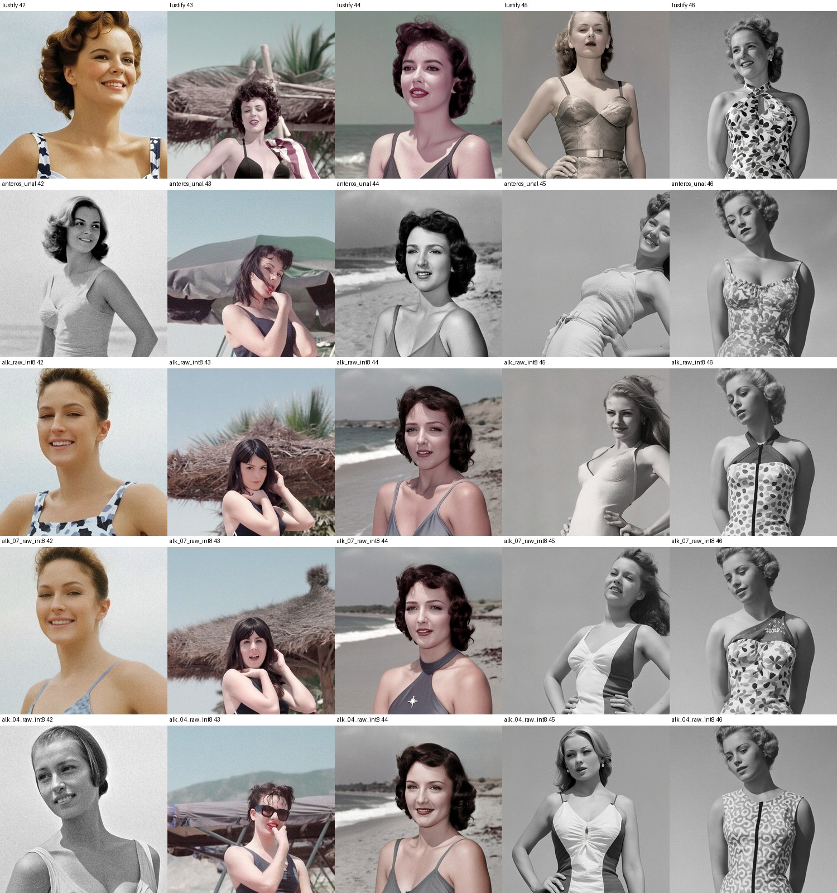

# Krea 2 Merge Tool

Merges, analyzes, extracts and converts Krea 2 diffusion models on Windows, with a GUI and a CLI.

- **LoRA merge**: several LoRA or LoKr files into one LoRA, exact when the inputs are ordinary LoRAs, with per LoRA strength and block shaping.
- **Analysis**: the singular value spectrum of every weight delta, the rank needed and the energy retained per layer group, a noise edge from the storage formats, and a Spectrum tab that plots it all and compares two analyses.
- **Extract**: a LoRA from the difference between two checkpoints in any storage format.
- **Checkpoint merge and convert**: one to three checkpoints and up to four LoRAs, nine merge methods, output in fp16, bf16, fp32, fp8, fp8 scaled or int8 convrot in the exact layout of the official Krea 2 files, or the result written as a LoRA.
- **Metadata**: what any file says about itself, with the author's folder paths taken out of it in place in milliseconds, a strip for publishing, an editor for the model spec fields, and the recipe of a merged file loaded back into the tab that made it.

Every run is described by a recipe. The recipe is stored in the output file's metadata with file names only, never folders, so a published file does not reveal where its inputs lived; it can be reloaded into the GUI, which looks for the named inputs next to the file, and reproduces the file byte for byte.





## Install and run

1. Install Python 3.12 from python.org with "Add Python to PATH" and tcl/tk enabled.
2. Run `install.bat`. It creates `venv`, installs torch from the PyTorch CUDA index (never the CPU only PyPI build), installs the other dependencies and runs a self check.
3. Run `run.bat` for the GUI. `run.bat --help` shows the CLI.

The GUI follows the display DPI and the Windows text size setting (Settings > Accessibility > Text size), which classic Windows programs otherwise ignore. The Scale box in the top right overrides it with a fixed 100 to 200 percent and applies at once. Theme and scale are remembered in `settings.json` next to the tool, or given on the command line with `--theme` and `--scale`.

The tool needs a Krea 2 diffusion model file. The text encoder and the VAE are separate files and are never touched.

## Files it reads and writes

| Format | Read | Write |
|---|---|---|
| bf16, fp16, fp32 | yes | yes |
| fp8 plain | yes | yes, with a warning: small weights are lost |
| fp8 scaled (official Krea 2 layout, legacy ComfyUI layout, per tensor descriptors) | yes | official layout |
| int8 convrot (official Krea 2 layout) | yes | yes |
| int8 without rotation | yes | no |
| LoRA: ComfyUI, kohya, musubi-tuner, diffusers, PEFT | yes | ComfyUI or kohya naming |
| LoKr (ai-toolkit, full or decomposed factors) | yes | converted to a LoRA by SVD |
| DoRA | refused | no |

Quantized outputs reproduce the official files: converting the official bf16 file gives the official fp8 scaled file bit for bit, and the official int8 convrot file bit for bit with the default MSE clip (`--int8-clip absmax` gives plain absmax scaling). The same 224 int8 layers with group size 256 and per row scales, the same 256 fp8 layers with scalar scales and the full precision flag on the output projections.

LoRA files in the diffusers naming of the Krea 2 conversion (`transformer.transformer_blocks.N.attn.to_q`, `text_fusion`, `img_in`, `time_embed`, `txt_in`, `time_mod_proj`, as written by OneTrainer and ai-toolkit) are mapped to the ComfyUI names automatically, get block shaping, and can be written out in ComfyUI or kohya naming.

## Block shaping

Every LoRA row and the second checkpoint can be shaped across the model's 28 blocks with the Neo-LoraCtl presets: COMPOSITION (blocks 0 to 8), CHARACTER (9 to 18), STYLE (19 to 27), with the modifiers Emphasize, Suppress and Isolate and a contrast slider. FULL, the default, applies no shaping. Two one click recipes come from Neo-LoraCtl's calibration:

- Character LoRA, keep the checkpoint's style: STYLE + Suppress at contrast 0.5.
- Style LoRA, protect faces: CHARACTER + Suppress at contrast 0.5.

Shaping of a checkpoint applies to the second checkpoint only. It scales that checkpoint's contribution per block, which is SuperMerger's block weighted merge. The second checkpoint also has a non block weight for the text side and the projections, which sit outside the block mask.

Timestep scheduling cannot be baked into a file and is not offered.

## Spectrum analysis

Analyze on the LoRA merge tab and on the Extract tab computes the full singular value spectrum of every module delta, one module at a time on the GPU, without writing anything. The log gets the report; the Spectrum tab gets the plots.

Per tensor: the singular values, the delta norm and its size relative to the base weight, the rank needed for 50 to 99.5 percent of the energy, the effective rank (the exponential of the entropy of the normalized squared singular values), the stable rank (delta energy over the largest squared singular value), the share of elements that did not change, the noise edge, the number of directions above it, and the ranks needed on the denoised spectrum. Per group: the same two rank criteria as before, raw and denoised. Overall: the energy a uniform rank of 8 to 1024 keeps, as the median and the minimum over the tensors, and the energy that sits outside the LoRA's reach in the norms, the modulation vectors and the biases, which no LoRA rank can carry.

The noise model. Two bf16 files differ by rounding noise even where the fine tune changed little. Each input contributes a per element variance from its storage layout: bf16 or fp16 rounding (`ulp^2 / 12`, with the step taken from the base weight's magnitude), the measured relative error of fp8 (4.5 percent) or int8 convrot (1.1 percent) spread over the elements, nothing for fp32. The noise edge is the largest singular value a matrix of that noise alone would have, `sqrt(variance) x (sqrt(m) + sqrt(n))`. Singular values below it cannot be told from noise, and the denoised ranks count only the directions above it. Elements whose delta is exactly zero round identically in both files and carry no noise, so the variance is scaled by the share of changed elements. The model remains an upper bound where an element changed by less than half a step and rounded to the same value anyway. An optional null spectrum (twice the decomposition time) computes the spectrum of the modeled noise for an overlay.

The Spectrum tab has four views: one tensor's spectrum with the noise edge, the configured rank and the cumulative energy raw and denoised; every tensor's cumulative energy with the median and the candidate ranks; a layer map of the eight linear leaves against the 28 blocks, with a second map for the norms and the modulation vectors and a table of the tensors outside the blocks, where a click opens the tensor; and a comparison of two saved analyses (median energy curves and histograms of effective rank, stable rank and relative change). Save analysis writes a pair `NAME.spectrum.npz` (the singular values) and `NAME.spectrum.json` (everything else); Load analysis and Load comparison read them back; Export writes a PNG of the figure or a CSV of the per tensor summary. The plots need matplotlib, which `install.bat` installs; without it the tab shows the tables.

### An example: which rank for a LoRA between two fine tunes

The three views below come from one analysis on the Extract tab: base `anterosXXXKrea2_unaligned`, target `anterosXXXKrea2_raw`, both stored in bf16, 264 target tensors, 89 seconds on an RTX 5090. The question was what rank a LoRA needs to carry the difference between the two checkpoints.



The per layer view shows one tensor, the output projection of block 14. Its singular values fall slowly and evenly over all 6144 directions: there is no knee, no point where the curve drops and flattens. The dashed line is the noise edge, the largest singular value that bf16 rounding alone could produce. It sits far below the curve, and 5235 of the 6144 directions are above it, holding 99.8 percent of the energy. The change in this tensor is real and spread everywhere, not rounding noise. The lower panel says what any truncation costs: 90 percent of the energy needs rank 2868, and the effective rank is 2986. The text column gives the same numbers for the tensor, plus its shape, the storage formats, the size of the change relative to the weight (2.4 percent) and the share of elements that did not change at all (6.4 percent).



The all layers view stacks the same curve for all 264 tensors, with the median in white and the candidate ranks as dotted lines. Every tensor behaves like the one above. The table under the plot is the practical summary: a rank 64 LoRA keeps 12 percent of the change's energy in the median tensor and 6 percent in the worst one, rank 256 keeps 26 percent, rank 1024 keeps 56 percent. The denoised columns are the same as the raw ones, because the noise share of this delta is 0.1 percent: denoising has nothing to remove here.



The layer map shows where the change sits. The top map is the relative change of the eight linear weights in every block: it is fairly even across the model at about 2 percent, larger in block 0 and largest in the last three blocks, where the attention gate and the MLP gate move by 5 percent. The bottom map covers the tensors a LoRA cannot carry, the norm scales and the modulation vectors: their change is small (under 1 percent) and the modulation vectors moved most in blocks 4 to 9. The table lists the tensors outside the blocks; the time embedding `tmlp.2` changed by 11 percent, the largest relative change in the whole delta. All of the energy outside the LoRA's reach adds up to 0.04 percent, so reach is not the problem here.

How to read this for the rank decision. A difference LoRA reproduces the target only up to the energy it keeps, and this delta is diffuse: no rank below about 3000 reproduces most of it, and the ranks that would (the "weighted rank" column of the report, 2600 to 4700 per group at 95 percent) are the size of the weights themselves. A LoRA of rank 1024 would be about 7.6 GB in fp16 and still carry only 56 percent of the energy. So the honest choices are three. Carry the whole change with a checkpoint merge instead (add difference with a weight, optionally block shaped), which is what this delta is. Or extract a LoRA at a modest rank (64 to 256) and accept that it carries a fraction of the change, then check with fixed seed generations whether that fraction is the part that matters, since energy counts every direction equally and the visible effect may be concentrated in fewer directions than the weights are. Or use the layer map to target the extraction: the last three blocks and block 0 changed most, and a LoRA on those blocks at a higher rank spends its budget where the change is.

What the analysis rules out is the hope that a small rank loses only noise. The noise edge shows that the tail of this spectrum is signal, and the denoised numbers are the raw numbers.

What to look for: a few large singular values followed by a flat tail mean a low intrinsic rank, and truncating at the knee loses little. A slow decay with no knee means the change is diffuse, and any small rank drops real signal. If most of the raw energy sits below the noise edge, a rank estimate in the thousands was mostly noise; if the tail sits far above the edge, the diffuse change is real and denoising will not rescue a small rank. Stable rank near 1 with a high effective rank means one dominant direction plus a diffuse cloud. A large share of energy outside the LoRA's reach means extraction cannot reproduce the fine tune and a checkpoint merge is the right tool. The same delta norm with a flatter spectrum in one of two runs means that run changed the weights more diffusely.

## Advisor

`run.bat advise -A keep.safetensors -B donor.safetensors -C ancestor.safetensors --goal add_content` measures how two fine tunes relate in weight space and proposes merge recipes. One pass over the three files gives the size of each change relative to the weights, per group and per block zone, the cosine between the two changes and how much of one sits inside the other, the spectrum of each change, the share of change outside the linears, and whether the storage precisions match. From that a rule set writes two to four candidates for the goal, each a complete recipe with its rationale, what to expect and what to compare. Goals: add B's content and keep A stable, take B's composition, take B's style, blend two siblings, de-Turbo a Turbo fine tune (B the official Raw, C the official Turbo), or distill B minus C into a LoRA. `--save STEM` keeps the advice and its spectra, `--run DIR` executes the candidates (`--pick N` for one), and every output carries its recipe. The Advisor tab does the same in the GUI: Advise fills a table of candidates with their reasoning, a goal change re-proposes without measuring again, Load into tab puts a candidate on the checkpoint or extract tab, Run selected and Run all write the candidates into a folder, and the two changes' spectra appear on the Spectrum tab with the comparison preloaded. The advisor scales the weights to the measurements and excludes methods that cannot apply; it does not judge images, so each candidate names the fixed seed comparison that decides.

## Metadata

The Metadata tab shows what a file says about itself and changes it without moving a single weight. A safetensors header is a length and a JSON block in front of the data, and every tensor offset is measured from the end of it, so metadata that only shrinks can be written back by padding the rebuilt header with spaces to the length the file already has. Scrubbing a 12.6 GB checkpoint takes about half a second and leaves its data byte for byte identical; only metadata that grows needs a new file.

**Redact paths** finds what a published file would reveal: Windows drive paths, UNC shares, `file://` URLs and the Linux and Colab roots, anywhere in any value, including inside the JSON blobs that trainers store. A path becomes its file name by default, or a placeholder, or takes its key with it, and each finding can be skipped. Three categories are opt in and remove their key whole: the trainers' metadata (`ss_*`, `sshs_*`, `ot_*`, which is where dataset folders and tag frequencies live), an embedded thumbnail, and an embedded ComfyUI workflow and prompt. The original header is saved next to the file first, so **Undo** is exact.

**Strip all metadata** writes a new file with nothing left but what the file needs in order to load. On an fp8 scaled checkpoint that is `_quantization_metadata`, the layer table the loader reads; on a bf16 or int8 convrot file it is nothing at all, exactly like the official releases.

**The editor** writes the model spec fields (title, author, description, license, trigger phrase, the required architecture, implementation and resolution), and says before you apply whether the header has room or a new file is needed. `Krea-2` and `Krea-2/lora` are the architecture strings the real Krea 2 trainers write. The data hash is the sha256 of the tensor data, which is the one hash a metadata edit does not change.

**Load recipe into tab** takes a file this tool made back to the tab it came from and says which of its inputs it could find; **Lineage** follows those inputs' own recipes and prints how the file was made, step by step.

Merges keep this honest at the source: the metadata a merge inherits from its inputs is redacted the same way, so a trainer's dataset folders are not republished by every file built on top of it.

```bash
run.bat meta show model.safetensors --lineage
```

```bash
run.bat meta redact S:\models\krea-2 --ss --thumbnail
```

```bash
run.bat meta strip model.safetensors -o model_clean.safetensors
```

```bash
run.bat meta set model.safetensors --title "Anteros + Kroma 0.15" --author me --compute-hash -o described.safetensors
```

## Checkpoint merge methods and what the weight means

A is the primary checkpoint and always has weight 1. B is the secondary with weight w. C is the optional reference, the common ancestor of A and B, usually the official Turbo file.

| Method | Formula | Meaning of w |
|---|---|---|
| Add difference (default) | A + w (B - C) | how many times B's change from C is applied to A. 1 transplants B's fine tune onto A, -1 removes it. Without C, C = A |
| Weighted sum | (1 - w) A + w B | position between A (0) and B (1). Outside that range extrapolates |
| SLERP | spherical interpolation | as weighted sum |
| Cosine A, Cosine B | SuperMerger | per column: keep A where A and B agree, take B where they differ. w shifts everything toward B. Use the same storage precision for A and B |
| TIES | trim, elect signs, merge (A - C) and w (B - C), add lambda x result to C | scales B's change before trimming |
| DARE | drop p of each change at random, rescale, sum | as add difference |
| trainDifference | SuperMerger | as add difference, damped where A already moved toward B |
| Extract | SuperMerger | interpolation of the two changes, masked to their common (beta 0) or distinct (beta 1) parts |

Vectors from (under More output options): the norm scales, modulation vectors and biases, every tensor that is not a 2-D weight, are merged like the rest by default. The option copies them from A, B or C instead. Use C to put an official file's vectors back after a fine tune or a third party de-Turbo that only touched the linears, or B at weight 0 to swap the vectors of one file for another's and change nothing else. Their share of a change is small (about 0.02 percent of the official distillation's energy), so expect a subtle effect.

### An example: dialing a donor into a fine tune



The same prompt ("a woman in a closed 1950s swimsuit is posing on a beach"), five seeds across, five models down: Lustify, Anteros Unaligned, and three add difference merges built as Anteros + w (Lustify - official Raw) plus the Kroma extract LoRA, with w at 1.0, 0.7 and 0.4 (the last with a STYLE Suppress shaping on Lustify and the LoRA at 0.7). Both fine tunes on their own render the period look: set curls, lipstick, pinup lighting. At w 1.0 the merge keeps the layouts of the official Raw but the faces turn present-day and the styling is gone; at 0.7 the same faces gain some of the grooming back; at 0.4 the period look returns on every seed and two seeds switch to Anteros' own compositions. Two things to take from it: stacking two realism fine tunes at full weight overshoots a style cue that each of them follows alone, so the equal contribution weight the advisor proposes is a ceiling rather than a default; and a seed's layout flips between the two parents at a threshold rather than sliding, so a sweep needs at least three points to see where that threshold sits.

## Command line

```bash
run.bat inspect model.safetensors lora.safetensors
```

```bash
run.bat convert krea2_turbo_bf16.safetensors krea2_turbo_int8_convrot.safetensors --format int8_convrot
```

```bash
run.bat lora-merge "epoch08.safetensors|1" "epoch10.safetensors|1" -o merged.safetensors --average
```

```bash
run.bat lora-merge "character.safetensors|1|STYLE:Suppress:0.5" -o character_clean.safetensors
```

```bash
run.bat extract krea2_turbo_bf16.safetensors finetune.safetensors -o finetune_lora.safetensors --rank 32 --analyze
```

```bash
run.bat ckpt-merge -A base.safetensors -B "finetune.safetensors|1|STYLE:Isolate:1.0@0" -C krea2_turbo_bf16.safetensors -o style_only.safetensors --as-lora 32
```

```bash
run.bat ckpt-merge -A finetune_raw.safetensors -B "krea2_raw_bf16.safetensors|0" -o finetune_raw_fixed.safetensors --format keep --vectors-from B
```

```bash
run.bat extract krea2_raw_bf16.safetensors finetune.safetensors -o unused.safetensors --analyze --spectrum finetune_vs_raw --energy 0.95
```

```bash
run.bat spectrum finetune_vs_raw.spectrum.json other_run.spectrum.json
```

```bash
run.bat run my_recipe.json
```

```bash
run.bat meta redact S:\models\krea-2
```

LoRA and checkpoint arguments take the form `FILE|WEIGHT|SHAPING`, where SHAPING is `PRESET:MODIFIER:CONTRAST[:BOOST][@NONBLOCK]`.

## Layout

- `krea2_merge_tool.py`: entry point.
- `k2merge/`: engine, CLI, GUI.
- `reference/`: the headers of the three official Krea 2 files and a script that summarizes them.
- `working_specs.md`, `development_plan.md`: the specification and the plan.
